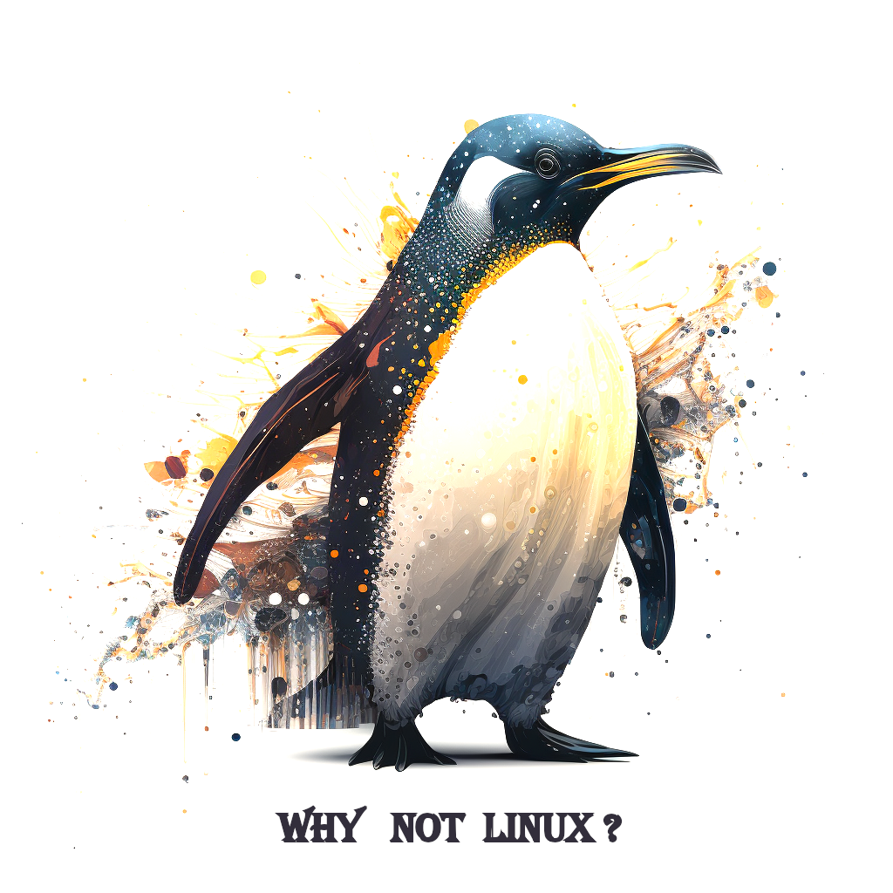

    

        🐧🚀 <b>Why Not Linux</b> est un événement dédié à la promotion de Linux et de l'Open Source. Cette année, l'événement inclut une Chasse au Trésor 🗝️🕵️ qui vous permettra de découvrir des indices 🔎, de relever des défis 💪, et de mettre vos compétences à l'épreuve 🧠💻.
    

    <h1>🐧 Why Not Linux - Chasse au trésor 🗝️💻🕵️‍♂️</h1>
     
      

## 🗝️ La Chasse au Trésor
La <b>  Chasse au Trésor </b> est une expérience de jeu amusante et interactive qui vous guidera à travers diverses étapes pour découvrir le trésor ultime. Chaque étape vous présentera un nouveau défi à relever et des indices pour vous aider à résoudre le puzzle.

## 🕵️‍♂️ Étapes
- Etape 1: Qui suis-je ? 🤔
- Etape 2: Donne moi la clé ou Ouvre moi la porte. 🔑🚪
- Etape 3: Ce fameux moyen de Communication 📞💬
- Etape 4: Mes différentes histoires: La meilleure version de moi. 📚📖
- Etape 5: Au cœur des galaxies de l'Univers. 🪐🚀
- Etape 6: Chassons les Démons 👹🔥
- Etape 7: Nous sommes toujours prêt à vous servir. 🏪👨‍💼
- Etape 8: Une demande du client 💼👨‍💼
- Etape 9: Juste le temps d'un instant. 🕰️⏰

## 💻 Comment Participer ?
La Chasse au Trésor a déjà commencé ! Il vous suffit de télécharger les assets dans les releases et de suivre les instructions pour chaque étape. 

À la fin de la chasse au trésor, nous annoncerons l'heureux gagnant qui remportera un lot spécial pour sa participation et ses compétences ! 🎁🎉

## 📍 Où Nous Trouver ?
Rejoignez-nous le 🗓️ 29 Avril 📍 à l'🏫 ESTI Antanimena pour la première édition de <b> Why Not Linux </b> et venez discuter avec des passionnés d'Open Source et de Linux. Restez connecté-e-s pour plus de détails sur les conférences et les activités prévues ! 🤩👨‍💻👩‍💻

Laissez une ⭐ si vous avez aimé le jeu et si vous souhaitez participer à la prochaine édition de <b> Why Not Linux </b>.

